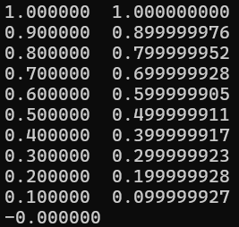

# Enostavni podatkovni tipi


## Znaki:

- signed char - števila ki grejo v 1 B

- unsigned char


---
## Cela števila:

- **signed short int** (vsaj 16 bit)

- **unsigned short int**

- **signed int** (vsaj 16 bit, običajno 32 bit, vendar odvisno od sistema):

    |--------------------------|-------------------------|
    
&nbsp;&nbsp;&nbsp;&nbsp;&nbsp;&nbsp;&nbsp;-2<sup>n-1</sup>&nbsp;&nbsp;&nbsp;&nbsp;&nbsp;&nbsp;&nbsp;&nbsp;&nbsp;&nbsp;&nbsp;&nbsp;&nbsp;&nbsp;&nbsp;
   &nbsp;&nbsp;&nbsp;&nbsp;&nbsp;&nbsp;&nbsp;&nbsp;&nbsp;&nbsp;&nbsp;&nbsp;&nbsp;&nbsp;&nbsp;&nbsp;&nbsp;&nbsp;0&nbsp;&nbsp;&nbsp;&nbsp;&nbsp;&nbsp;&nbsp;&nbsp;&nbsp;&nbsp;
   &nbsp;&nbsp;&nbsp;&nbsp;&nbsp;&nbsp;&nbsp;&nbsp;&nbsp;&nbsp;&nbsp;&nbsp;&nbsp;&nbsp;&nbsp;&nbsp;&nbsp;&nbsp;&nbsp;2<sup>n-1</sup> - 1&nbsp;&nbsp;&nbsp;&nbsp;&nbsp;&nbsp;&nbsp;&nbsp;&nbsp;&nbsp;(n = 32)
   

- **unsigned int**:

    |----------------------------------------------------| 

&nbsp;&nbsp;&nbsp;&nbsp;&nbsp;&nbsp;&nbsp;&nbsp;&nbsp;&nbsp;0&nbsp;&nbsp;&nbsp;&nbsp;&nbsp;&nbsp;&nbsp;&nbsp;&nbsp;&nbsp;&nbsp;&nbsp;&nbsp;&nbsp;&nbsp;&nbsp;&nbsp;&nbsp;&nbsp;&nbsp;&nbsp;&nbsp;&nbsp;&nbsp;&nbsp;&nbsp;&nbsp;&nbsp;&nbsp;&nbsp;&nbsp;&nbsp;&nbsp;&nbsp;&nbsp;&nbsp;&nbsp;&nbsp;&nbsp;&nbsp;&nbsp;&nbsp;&nbsp;&nbsp;&nbsp;&nbsp;&nbsp;&nbsp;&nbsp;&nbsp;&nbsp;&nbsp;&nbsp;&nbsp;&nbsp;&nbsp;&nbsp;&nbsp;&nbsp;&nbsp;&nbsp;&nbsp;&nbsp;&nbsp;&nbsp;&nbsp;&nbsp;&nbsp;&nbsp;&nbsp;&nbsp;2<sup>n</sup> - 1&nbsp;&nbsp;&nbsp;&nbsp;&nbsp;&nbsp;&nbsp;&nbsp;&nbsp;&nbsp;&nbsp;&nbsp;(n = 32)

- **signed long int** (vsaj 32 bit)

- **unsigned long int**

-------------------------------------------------------------------

        Velja: 

          short int       <=         int          <=      long int
        (vsaj 16 bit)           (vsaj 16 bit)           (vsaj 32 bit)


---
## Realna števila:

- float 

- double

- long double


0.1<sub>10</sub> = 1 * 10<sup>-1</sup> + 0 * 10<sup>-2</sup> + ...

0.d<sub>1</sub>d<sub>2</sub> ... d<sub>n</sub>

1/10 != d<sub>1</sub> * 2<sup>-1</sup> + d<sub>2</sub> * 2<sup>-2</sup> + d<sub>3</sub> * 2<sup>-3</sup> + ... + d<sub>n</sub> * 2<sup>-n</sup> (ne moremo zapisati kot vsoto potenc dvojk)

števec = 1 != 2 * 5 * (d<sub>1</sub> * 2<sup>-1</sup> + d<sub>2</sub> * 2<sup>-2</sup> + d<sub>3</sub> * 2<sup>-3</sup> + ... + d<sub>n</sub> * 2<sup>-n</sup>)

imenovalec = 10 != 2<sup>n</sup>

--> Sledi, da v računalniku ne moremo predstaviti vseh realnih števil, zato uporabljamo predstavitev s plavajočo vejico, kjer nimamo neomejeno decimalnih mest, zato se lahko program včasih obnaša drugače, kot bi pričakovali za operacije s pravimi realnimi števili.

---

```c
#include <stdio.h>

int main(){
    float num = 1.0;
    float step = 0.1;

    while(num != 0.0){  // POGOJ NI OK!
        printf("%f %12.9f\n", num, num);
        num = num - step;
    }

    printf("%f\n", num);
    return 0;
}
```

zgornji primer programa ni v redu ker ne upošteva, da je num float, zgodi se naslednje:


ker num zaradi napak v predstavitvi s plavajočo vejico nebo nikoli točno 0, je while zanka zaciklana

Namesto zgornjega pristopa, raje uporabimo funkcijo fabsf(float x) iz knjižnice math, ki vrne absolutno vrednost spremenljivke x tipa float (ogled podrobnosti: ```man fabs```):

```c
#include <stdio.h>
#include <math.h>

int main(){
    float num = 1.0;
    float step = 0.1;

    while(fabsf(num) > 0.001){  // NE PREVERJAMO ENAKOSTI, AMPAK BLIŽINO NIČLI
        printf("%f %12.9f\n", num, num);
        num = num - step;
    }

    printf("%f\n", num);
    return 0;
}
```

rezultat je: 



Pazimo tudi na to, da seštevanje "realnih števil" v c tudi ni vedno komutativno:

        float a = ___;
        float b = ___;
        
        if((a + b) + b == a + (b + b)){
            ...
        }
---
        velja:
        če b = 0.05:     a + b = 1.00 + 0.05 = 1.05
        če b = 0.005:    a + b = 1.00 + 0.005 = 1.00
--- 
        zato poglejmo obe možnosti:
        
        (a + b) + b = (1.00 + 0.005) + 0.005 = 1.00 + 0.005 = 1.00

        a + (b + b) = 1.00 + (0.005 + 0.005) = 1.00 + 0.01 = 1.01

        oziroma z drugim zapisom:

        (a + b) + b = (1.00E0 + 5.00E-3) + 5.00E-3 = 1.00E0 + 5.00E-3 = 1.00E0

        a + (b + b) = 1.00E0 + (5.00E-3 + 5.00E-3) = 1.00E0 + 1.00E-2 = 1.01E0

---

Poglejmo še ta program:

```c
#include <stdio.h>

int main(){
    float a = 0.1;
    float b = 0.1;

    while((a + b) + b == a + (b + b)){
        printf("%f %f : %f == %f\n", a, b, (a + b) + b, a + (b + b));
        b = b / 2.0;
    }

    printf("%f %f : %f == %f\n", a, b, (a + b) + b, a + (b + b));
    return 0;
}
```

tukaj zgleda ni problemov:


nam pa že majhen popravek programa pokaže, da števili v resnici nista enaki:
če spremenimo zadnji klic ```printf("%f %f : %.9f != %.9f\n", a, b, (a + b) + b, a + (b + b));```, s tem izpišemo števili na 9 decimalk:


- float 

- double

- long double

```c
float a = 1;
float b = 1.0;
// a in b NI ENAKO, prvo je celo število (ki ga shranimo kot float), drugo pa float
```
    double + int = double 
    
    c pretvori v največji tip in priredi, to dela avtomatsko če gre, sicer opozori

Poglejmo si naslednji program, kaj bo izpisal?

```c
#include <stdio.h>

int f();

int main(){
    printf("%d\n", f(3));
    printf("%d\n", f(3.14));
    
    return 0;
}

int f(int n){
    printf("[%d]\n", n);
    return 2 * n;
}
```
najprej opazimo, da se prototip funkcije: ```int f();``` ne sklada z dejansko deklaracijo: ```int f(int n){...}```, kar ni zaželjeno. Poglejmo si oba izpisa programa:


Razkrijeta nam, da se pri klicu z argumentom tipa ```int```: ```3``` program izvede po pričakovanjih, pri klicu z napačnim argumentom neceloštevilskega tipa ```float```: ```3.14``` pa dobimo povsem nepričakovane rezultate. Novejši prevajalniki bodo za tako kodo izpisali opozorilo ali celo napako pri prevajanju, nekateri prevajalniki pa bodo prevedli kodo pri čemer ne vemo točno, kako.


---
## Logične vrednosti:
- logična vrednost false je določena kot število 0, true pa katerokoli drugo od 0 različno število:

```c
if(10 - 9){
    // se izvede
}

if(10 - 10){
    // se NE izvede
}
```

- za lažjo uporabo dodamo z ```#include <stdbool.h>```, tako lahko uporabimo tip ```bool```:

```c
bool jeOpravil = true;
bool jePrepisal = false;
```


---
## Dodatno
- operator ```sizeof()``` nam pove, kako velik je dan številski tip (vrne long):


---
## Bitni pomik in operacije

1<sub>10</sub>&nbsp;&nbsp;&nbsp;&nbsp;&nbsp;&nbsp;&nbsp;&nbsp;&nbsp;&nbsp;&nbsp;&nbsp;&nbsp;&nbsp;&nbsp;&nbsp;&nbsp;&nbsp;&nbsp;&nbsp; 000 ... 000001<sub>2</sub>

1<sub>10</sub> << 1 &nbsp;&nbsp;&nbsp;&nbsp;&nbsp;&nbsp;&nbsp;&nbsp;&nbsp;&nbsp;&nbsp;000 ... 000010<sub>2</sub> = 2<sub>10</sub>

1<sub>10</sub> << 5 &nbsp;&nbsp;&nbsp;&nbsp;&nbsp;&nbsp;&nbsp;&nbsp;&nbsp;&nbsp;&nbsp;000 ... 100000<sub>2</sub> = 32<sub>10</sub>

Napisati želimo program, ki bo izpisal vse variacije s ponavljanjem na *n*-mestih, s *k*-elementi:

n = 5, k = 2 = |{A, B}|

2<sup>n</sup> vrstic&nbsp;&nbsp;&nbsp;&nbsp;&nbsp;dvojiško&nbsp;&nbsp;&nbsp;&nbsp;desetiško<br>
AAAAA&nbsp;&nbsp;&nbsp;&nbsp;&nbsp;&nbsp;&nbsp;&nbsp;00000&nbsp;&nbsp;&nbsp;&nbsp;&nbsp;&nbsp;&nbsp;&nbsp;0<br>
AAAAB&nbsp;&nbsp;&nbsp;&nbsp;&nbsp;&nbsp;&nbsp;&nbsp;00001&nbsp;&nbsp;&nbsp;&nbsp;&nbsp;&nbsp;&nbsp;&nbsp;1<br>
AAABA&nbsp;&nbsp;&nbsp;&nbsp;&nbsp;&nbsp;&nbsp;&nbsp;00010&nbsp;&nbsp;&nbsp;&nbsp;&nbsp;&nbsp;&nbsp;&nbsp;2<br>
...<br>
BBBBB&nbsp;&nbsp;&nbsp;&nbsp;&nbsp;&nbsp;&nbsp;&nbsp;&nbsp;11111&nbsp;&nbsp;&nbsp;&nbsp;&nbsp;&nbsp;&nbsp;&nbsp;31<br>

Pomagali si bomo še z bitnimi operacijami:<br>
```
&   ... bitni AND
|   ... bitni OR
^   ... bitni XOR
~   ... bitni NOT (1'K)
<<  ... bitni pomik v levo
>>  ... bitni pomik v desno
```

Kako pridobimo 1'K (eniški komplement) števila? Izvedemo bitni NOT nad dvojiškim številom.

Za naš primer bomo izvedli bitni AND s številom *i* (vrstica) in številom, ki ga dobimo z bitnim pomikom enke za *j*-mest:
```
         i = 01011
    1 << j = 00001  [j = 0]
bitni AND:   00001 = 1, kar je true = (i & (1 << j))

...

         i = 01011
    1 << j = 00100  [j = 2]
bitni AND:   00000 = 0, kar je false = (i & (1 << j))

...
```

s tem dobimo pogoj, kdaj izpisati 'A' in kdaj 'B':

```c
#include <stdio.h>

int main(){

    int n = 5;
    int k = 2;

    for(int i = 0; i < (1 << n); i++){  // (i < 32)
        for(int j = 0; j < n; j++){
            if(i & (1 << j)){
                printf("B");
            }
            else{
                printf("A");
            }
        }
        printf("\n");
    }

    return 0;
}
```

---
DODATNO, KORISTNE OPERACIJE Z BITNIMI OPERATORJI
???
Recimo da imamo dvojiško število: 01001010, potem bomo izvedli bitni OR z bitno negiranim številom:
```
število:    01001010
negirano:   10110101
bitni OR:   11111111

```
???

---


---
### Naloga: 
Napiši program, ki bo izpisal vse variacije s ponavljanjem na *n*-mestih, s *k*-elementi:

npr. n = 5, k = 3 = |{A, B, C}|

AAAAA i=0<br>
AAAAB i=1<br>
AAAAC i=2<br>
AAABA i=3<br>
...<br>
CCCCC i=3<sup>n</sup><br>

```c
// rešitev:
...
```