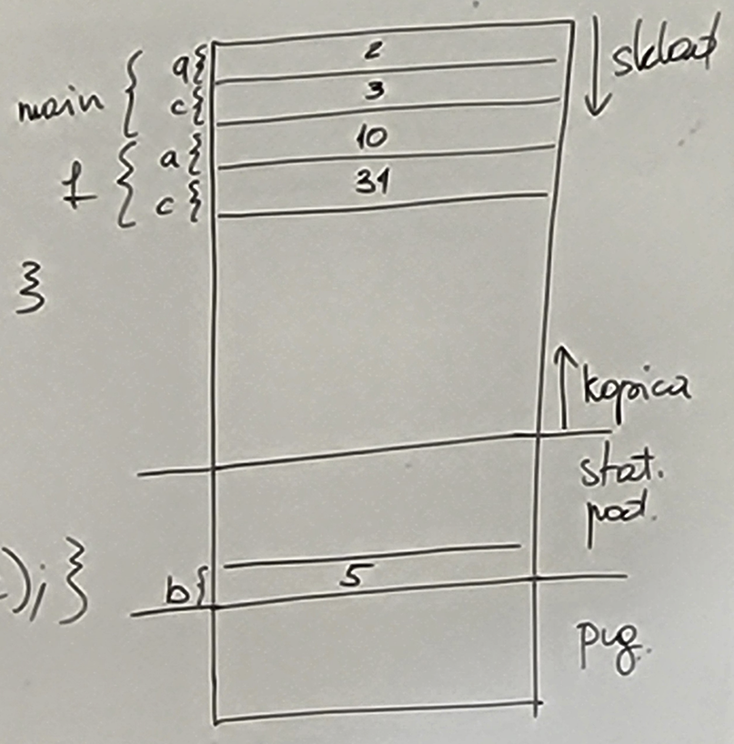
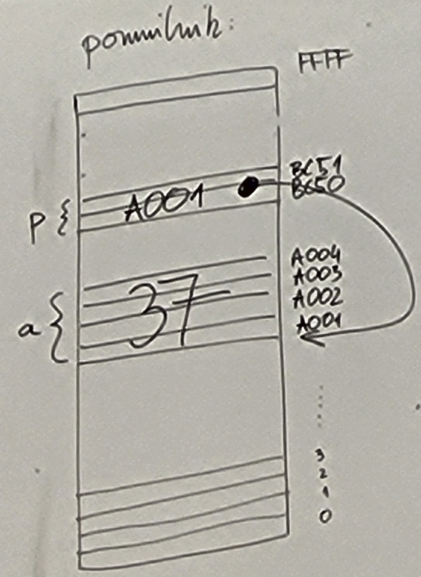

# Spremenljivke v pomnilniku, kazalci

## Spremenljivke v pomnilniku

pomnilnik (64 kB = 2<sup>6</sup>)&nbsp;&nbsp;&nbsp;&nbsp;&nbsp;&nbsp;[16<sup>4</sup> = 65536 B]:

|RAM:|address:|
|---|---|
||FFFF|
||FFFE|
|...||
||2|
||1|
||0|

program v C si razdeli pomnilnik na ~4 dele:<br>
stack (malo prostora)<br>
heap (veliko prostora)<br>
static data (statični podatki, veliko prostora)<br>
code (strojni ukazi našega programa)<br>

|RAM|
|---|
|stackˇˇˇˇˇˇ|
|...|
|heap^^^^^^|
|static data|
|code|

```c
int b;  // globalna spremenljivka, vidna povsod - ZUNANJA (external) - sodi med statične podatke

int main(){
    int a = 3;  // lokalna spremenljivka, vidna samo v tej funkciji navzdol - AVTOMATSKA - na skladu
    printf("%d", a+b);
    return 0;
}
```

```c
int b = 5;
int f(int a){
    int c = 31;
    return a + b + c;
}
int main(){
    int a = 2;
    int c = 3;
    return f(a + b + c);
}
```
Zgornji program: program se naloži v pomnilnik, med statične podatke rezervira 4 B za b in inicializira na 5. Sproži se main(), z dvema lokalnima spremenljivkama, ki gresta na sklad in dobita ustrezni vrednosti. Kliče se f(10) in na sklad gresta a in c od funkcije f. Funkcija f vzame najnizji a in c ter b iz statičnih podatkov in vrne. Del sklada funkcije f izgine. Tudi main vrne in sklad postane prazen (funkcije so avtomatske). (istoimenske spremenljivke se ločijo po naslovu v pomnilniku)



### Vrste spremenljivk:
- **avtomatske** (*auto*) - živijo na skladu, v funkcijah, ni default inicializacije (karkoli iz rama), po koncu funkcije izginejo iz pomnilnika
```c
int f(){
    ... 
    int a;
    auto int b; ...}
```

- **zunanje** (*extern*) (ali se vidi zunaj tega prevedenega dela programa) - med statičnimi podatki, zunaj funkcij - default inicializacija z vrednostjo 0
```c
int a;  // definiramo spremenljivko in določimo/rezerviramo prostor v pomnilniku zanjo
extern int b;   // definiramo spremenljivko brez določitve/rezervacije prostora (to bomo storili v drugi datoteki - doma je drugje ne v tej datoteki, mogoče je del knjižnice)
```

- **registrske** (*register*) - spremenljivke ki naj bodo v registru, če je to mogoče
```c
register int a;
```

- **statične** (*static*) - spremenljivke med statičnimi podatki, default inicializacija z vrednostjo 0
```c
static int a;
```

```c
int f(int a){
    int c = 3;  // a in c sta na skladu
    static int b = 31;  // b je med statičnimi podatki, ne vidi pa se je zunaj te funkcije
}
```

```c
int a = 10;  // statična, inicializirana na 0
extern int b;   // definirana v nekem drugem delu programa, zaradi tega jo lahko vidimo tudi tukaj
static int c;   // c je statična (private, skrita), inicializirana na 0
void f(){
    static int a = 20;
    printf("%d\n", a);    // izpis: 20
}
int main(){
    f();
    printf("%d\n", a);    // izpis: 10
}
```

```c
int seed = 17;
int random(){
    seed = (191 * (seed + 1321)) % 17231;
    return seed;
}
```

```c
int random(){
    static int seed = 17;   // seeda nemoremo uporabiti izven te funkcije - skrijemo statično spremenljivko v to funkcijo, INICIALIZACIJA SE ZGODI LE ENKRAT IN NE OB VSAKEM KLICU - naslednji klic bo imel seed ki je enak prejšnji random vrednosti
    seed = (191 * (seed + 1321)) % 17231;
    return seed;
}
```

## Kazalci

Kazalec je spremenljivka ki hrani naslov.

```c
int a;  // a hrani celo število
int *p; // p hrani naslov celega števila v pomnilniku (p je kazalec na int)

a = 37;
p = &a; // vzamemo naslov od spremenljivke a in ga shranimo v p
printf("%d\n", a);  // izpis: 37
printf("%p\n", p);  // izpis: A001 (%p za izpis pointerja s printf)
printf("%d\n", *p); // izpis: 37 (vzame kazalec p, naslov ki je v njem shranjen, gre na ta naslov in pridobi vrednost ki je tam shranjena)
```



```
int* p ... kazalec na int
int *(q[10]) ... kazalec na tabelo 10 intov
int (*r)[10] ... tabela 10 kazalcev na int
p ... naslov kjer je vrednost
*p ... vrednost na naslovu p
&p ... naslov kjer je shranjen naslov kjer je vrednost
int* p = &a; ... enakovredno kot: int* p; p = &a;
scanf("", NASLOV)
```

```c
int a = 37; // a = 37
int *p = &a;    // EKVIVALENTNO: int *p; p = &a; (p = A001) 
int b = 2 * (*p);    // b = 2 * 37 = 74
*p = 12;    // a = 12
*p = (*p) * 3;  // a = 36
```

```c
int mul2(int a){
    return 2*n;
}
int mul4(int *n){
    *n = *n * 4;    // m = 14 * 4 = 56
    return *n;  // 56
}

int main(){
    int m = mul2(7);    // pošljemo številko
    int k = mul2(m);    // pošljemo številko (vrednost m-ja)

    // PRINTF:
    printf("%d\n", m);  // vrednost m-ja se izračuna, ta klic je v bistvu enak kot spodnji:
    printf("%d\n", 14);

    // SCANF:
    scanf("%d", &m);    // vrednost &m se izračuna v naslov m-ja, ta klic je v bistvu enak kot spodnji (recimo da je 0xC8A4 naslov m-ja):
    scanf("%d", 0xC8A4);
    scanf("%d", m); // vrednost m-ja, klic je enak kot spodnji:
    scanf("%d", 14);    // piše ga na naslov 14!
// m = 14, k = 28
    k = mul4(&m);   // 0xC8A4 gre v funkcijo mul4
// m = 56, k = 56
}
```

```c
int a = 12;
int *p = &a;    // kazalec p kaže na naslov od a
*p = (*p) * 3;  // vrednost na naslovu v p je ...
p = NULL;   // ne kaže nikamor (oziroma na naslov nič(0x0000), kamor ne moremo niti pisati niti brati)
*p = 17;    // error: Segmentation fault - skušali smo pisati na segment pomnilnika, kamor ni dovoljeno pisati
```