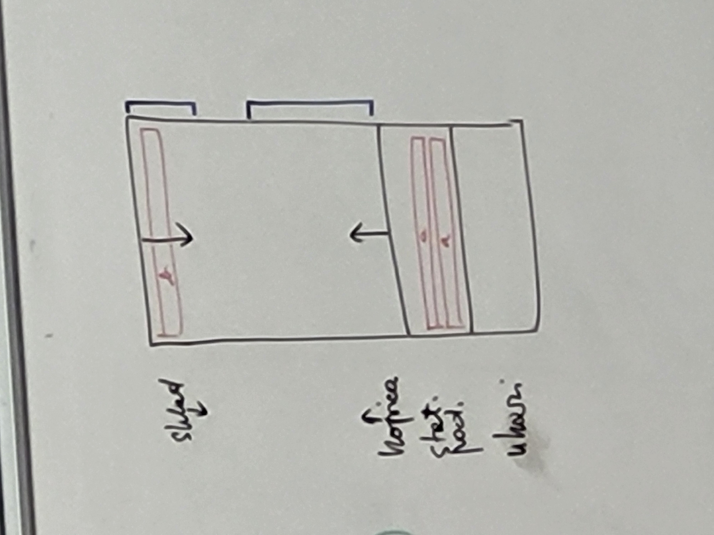
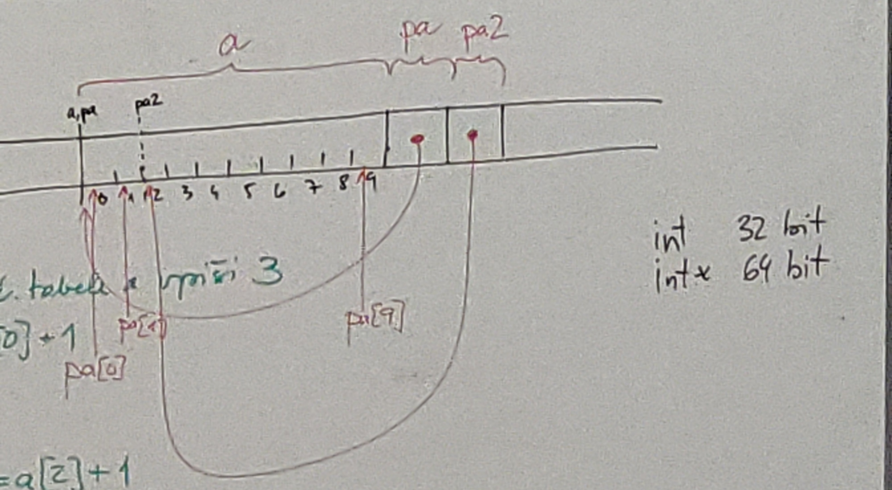
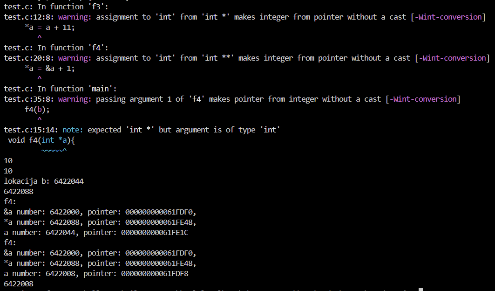

### Domača naloga 2:
```c
char c; // števila oz. znaki
char *p = NULL; // naslov znaka
char **P = NULL;   // naslov naslova znaka
```

# Tabele in kazalci

## Kazalci

```

& ... za pridobivanje naslova elementa (ni lvalue - ne nahaja se na levi strani prireditvenega operatorja)

* ... za shranjevanje naslova v obliki kazalca (pointerja), je lvalue

int *p = ´naslov´;   // pointer to address p which contains int
(zgornja vrstica je ista kot: int *p; p = ´naslov´)

int a = *p;  // value at address p

int address = p;    // address stored in pointer p
```

## Tabele

```tip ime[velikost];```

primeri:



```
array[2] ... enakovredno kot: *(array + 2)
```

```c
#include <stdio.h>

int a[10];  // tabela 10 intov: 10 x 4 B (med statičnimi podatki, vidna v vseh funkcijah od deklaracije naprej)
int main(){
    int b[10];  // avtomatska tabela (na skladu)
    static int c[10];   // statična tabela, med statičnimi podatki, vidna le v tej funkciji od deklaracije navzdol

    a[5] = 0;
    a[-5] = 0;  // dovoljeno
    a[15] = 0;  // dovoljeno
}

int f(){
    a[5] = 8;
    b[4] = 9;   // NAPAKA
    c[3] = 0;   // NAPAKA
}
```
|lokacije:|0|1|2|3|4|5|6|7|8|9|10|11|12|13|14|15|16|17|18|19|
|---|---|---|---|---|---|---|---|---|---|---|---|---|---|---|---|---|---|---|---|---|
|naslavljanje tabele:|_|a[-5]|_|_|_|_|a[0]|a[1]|a[2]|a[3]|a[4]|a[5]|a[6]|a[7]|a[8]|a[9]|_|_|a[12]|_|

- c zaradi hitrosti ne pregleduje range od funkcije f: ```a[f()] = 7```, za razliko od Jave

- **velikih tabel ne dajemo na sklad**, ker na skladu ni veliko prostora, dajemo jih med statične podatke, ker je tam veliko prostora - tudi samodejno se inicializira za razliko od avtomatskih, ki nastanejo šele ob sprožitvi funkcije in so vrednosti v njih nepredvidljive

- **Segmentation fault**, ko gre sklad čez mejo pomnilnika, do kjer lahko še piše

- če se main kliče rekurzivno, se vrednosti v tabeli c ohranijo, ker se nova tabela c pojavi tam kjer je bila stara v pomnilniku

```c
int a[10];
int *pa;    // kaže na NULL (lokacija 0)
printf("%p, %p\n", pa, &pa);    // najprej izpiše naslov kamor kaže kazalec pa (lokacija 0 - NULL), nato izpiše naslov, kjer je shranjen kazalec pa (000000000061FDE8)

pa = &(a[0]);
a[0] = 3;   // v 1. element tabele a vpiši 3
pa[0] = pa[0] + 1;  // pa[0] je isto kot *(pa + 0) (vzemi naslov ki je v pa in pojdi na to lokacijo)
// pa je tipa int* - kazalec na lokacijo z int
// *pa je tipa int - vrednost na lokaciji pa

int *pa2;
pa2 = &(a[2]);
pa2[0] = pa2[0] + 1;
pa2[-2] = pa2[-2] + 1;
pa2[9] = 0;     // NEVARNO - šli smo čez meje tabele
pa2++;  // pa2 povečaj za sizeof int (za 4, ker int 4 B)
pa2[0] = 7; // a[3] = 7
```

```
pa[0] = *pa
pa[1] = *(pa + 1)
pa[7] = *(pa + 7)
```

- c nas ne opozori če overridamo spremenljivke v pomnilniku



- kako podajamo **tabele v funkcije** kot argumente v parametre: nemoremo shraniti veliko elementov ker imamo omejeno število registrov, zato podamo le naslov prvega elementa:

```c
int sum(int *tabela, int stElementov){  // kar se dejansko zgodi
    int s = 0;
    for(int i = 0; i < stElementov; i++){
        s = s + tabela[i];    // isto kot s = s + (*tabela); tabela++;
    }
    return s;
}

int sum1(int tabela[], int stElementov){    // pričakujemo tabelo, le drugačen zapis za isto stvar, isto dobimo kazalec
    int s = 0;
    for(int i = 0; i < stElementov; i++){
        s = s + tabela[i];
    }
    return s;
}

int sum2(int tabela[100], int stElementov){ // pričakujemo tabelo 100 elmentov - vendar to ni obvezujoče, isto dobimo kazalec
    int s = 0;
    for(int i = 0; i < stElementov; i++){
        s = s + tabela[i];
    }
    return s;
}
// sum, sum1, sum2 so enakovredne

int na[100];
int main(){
    int vsota1 = sum(&(na[0]), 100);    // seštejemo celo tabelo, ISTO KOT: sum(na, 100)
    int vsota2 = sum(&(na[7], 5));  // seštejemo le podtabelo

    int i = 2;
    sum(&i, 1);
    sum(&i, 10);    // NEVARNO - šli bomo v pomnilniku dlje od lokacije i-ja, zato nevemo kaj se tam nahaja

    // na je isto kot &(a[0])

    printf("%p\n%p\n%p\n", &(a[0]), &pa, &pa2); // izpišemo NASLOVE KJER SE NAHAJAJO KAZALCI
    printf("%p\n%p\n%p\n", &(a[0]), pa, pa2); // izpišemo NASLOV NA KAR KAŽE

    sizeof(na); // = 400 (v bajtih)
    sizeof(na[0]);  // = 4  (vrednost int)
    sizeof(pa); // = 8 (lokacija)
}
```

```c
#include <stdio.h>

void f(int a){
    a = a + 1;
}

void f2(int *a){
    a = a + 10;
}

void f3(int *a){
    *a = a + 11;
}

void f4(int *a){
    // &a ... naslov kjer se nahaja pointer *a
    // *a ... vsebina na naslovu a - v tem primeru lokacija od argumenta (b)
    // a ... naslov na katerega kaže kazalec *a
    printf("f4:\n&a number: %d, pointer: %p,\n*a number: %d, pointer: %p,\na number: %d, pointer: %p\n", &a, &a, *a, *a, a, a);
    *a = &a + 1;
}

int main(){

    int b = 10;
    f(b);
    printf("%d\n", b);
    f2(&b);
    printf("%d\n", b);
    printf("lokacija b: %d\n", &b);
    f3(&b);
    printf("%d\n", b);

    f4(&b);
    f4(b);
    printf("%d\n", b);  // vrne to kar je v a v funkciji f4 - to je naslov od b-ja

    return 0;
}
```



```c
int a[100];
int b[100];
int c[100];
for(int i = 0; i < 100; i++){
    c[i] = a[i] + b[i];
}

// isto kot:

int *pa = &a[0];
int *pb = &b[0];
int *pc = &c[0];
for(int i = 0; i < 100; i++){
    *pc = *pa + *pb;
    pa++;
    pb++;
    pc++;
}
```

### Uporaba kopice

```c
int a;
int *pa;    

pa = &a;
*pa = 3;
pa = (int*) malloc(sizeof(int));   // malloc (memory allocate) vrača void*; malloc isto kot new v Javi; "pa" kaže na kopico
*pa = 7;    // 7 napišem na naslov v pa (ki je na kopici)

// ko jih nehamo uporabljati:
free(pa);   // teh 4 bajtov na kopici ne uporabljamo več, Java to stori s čistilcem pomnilnika, tega v c-ju ni
```

```c
int *pa;
pa = (int*) malloc(100 * sizeof(int));  // malloc vrača void*; lahko tudi sizeof(int[100])
for(int i = 0; i < 100; i++){
    pa[i] = 0;
}
free(pa);
```

```c
int *p = calloc(10, sizeof(int)); // calloc tudi inicializira
free(p);
```