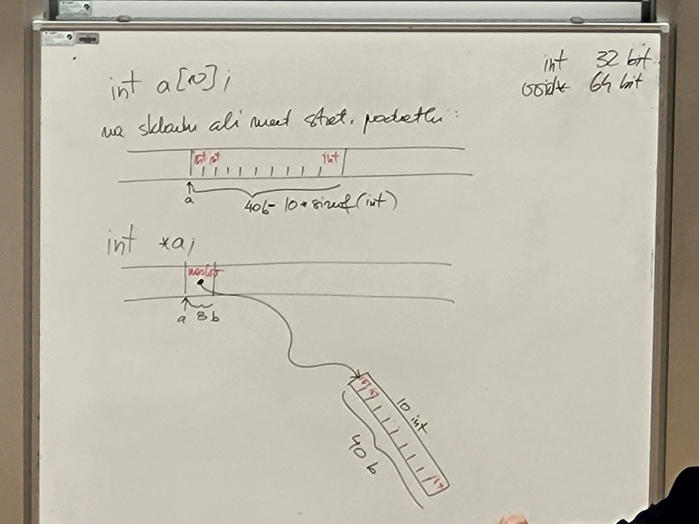
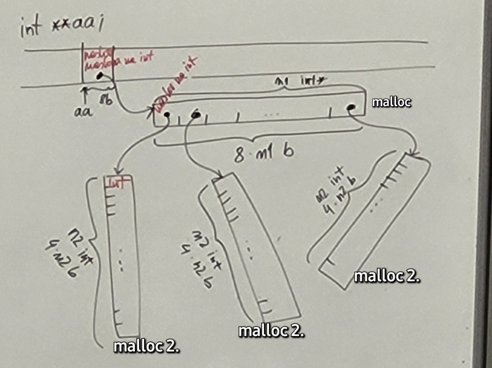
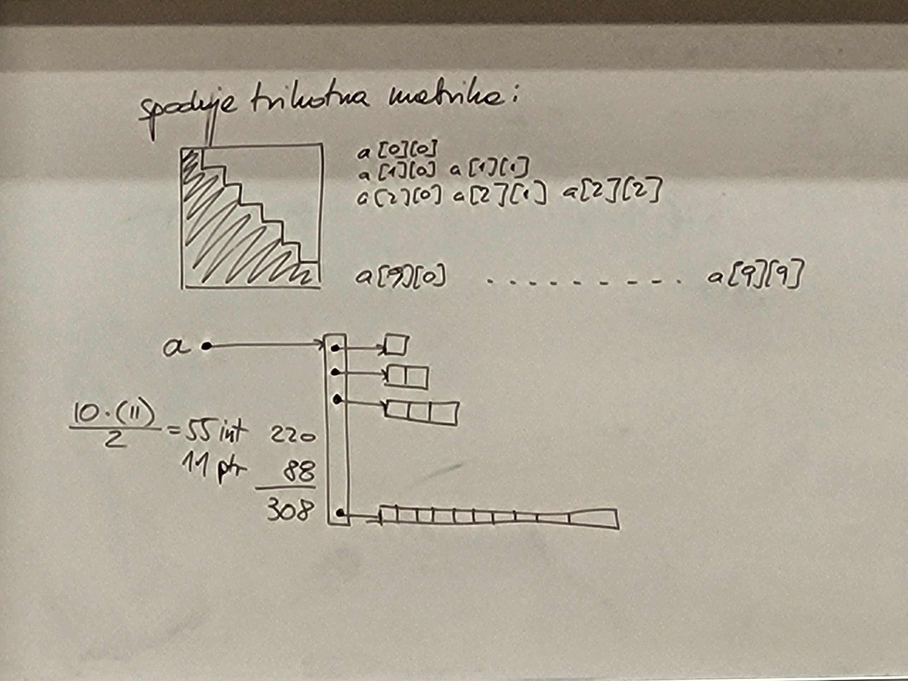
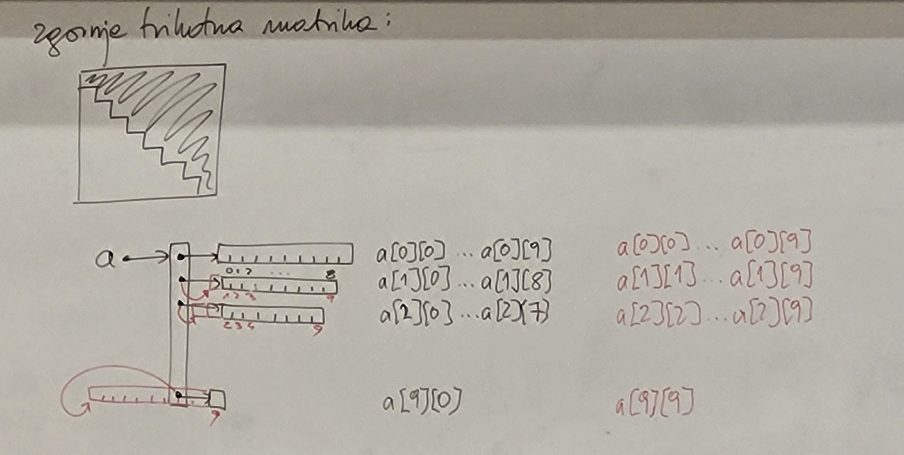
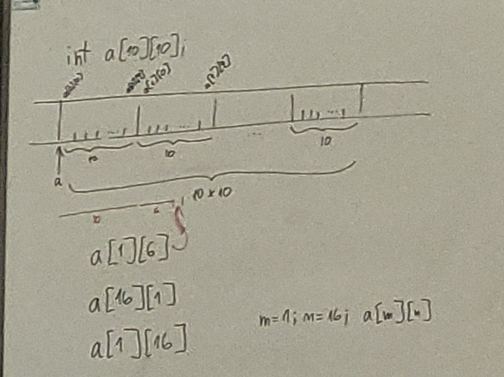
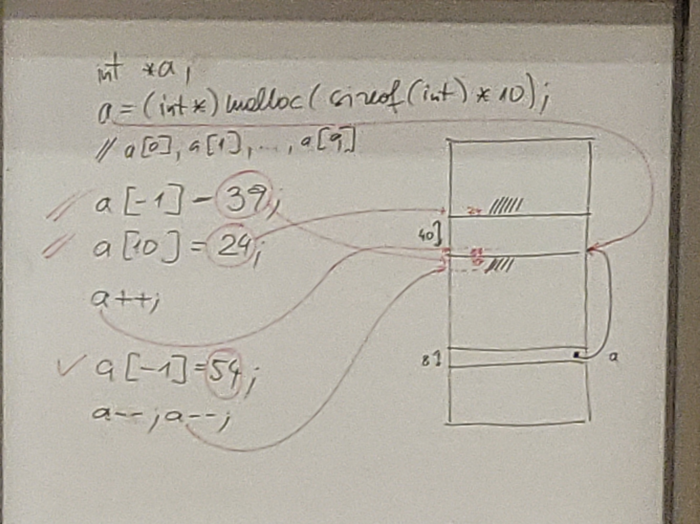
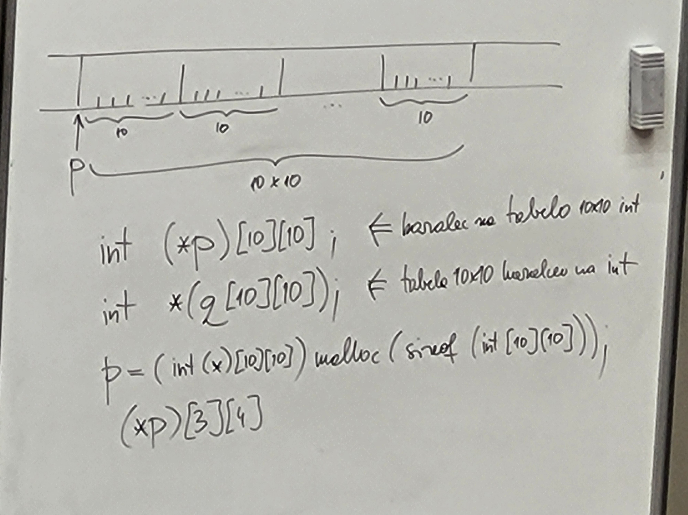

# Večdimenzionalne tabele in nizi

## Večdimenzionalne tabele

int ... 32 bit

void* ... 64 bit

```c
int a[10];  // rezervira 10 intov na skladu ali med statičnimi podatki; sizeof(a) = 40 (10 * sizeof(int))
int aa[10][10];
int aaa[10][10][10];
```

```c
// 1 DIMENZIJA:
int n;
scanf("%d", &n);
int *a; // 
a = (int*) malloc(n * sizeof(int));

// a ... tipa int*
// a[3] ... tipa int

for(int i = 0; i < n; i++){
    a[i] = 0;   // isto kot *(a + i)
}
free(a);
```


```c
// 2 DIMENZIJI:
int n1;
int n2;
scanf("%d", &n1);
scanf("%d", &n2);
int **aa;   
aa = (int**) malloc(n1 * sizeof(int*)); // sizeof int*!!

// aa ... tipa int**
// aa[3] ... tipa int*
// aa[3][5] ... tipa int
// a** vrednost na lokaciji kazalca *a

for(int i = 0; i < n1; i++){
    aa[i] = (int*) malloc(n2 * sizeof(int));
}

// uporaba tabele aa, posamezni element: aa[3][7]

for(int i = 0;  i < n1; i++){
    free(aa[i]);
}
free(aa);
```






```c
int a[10];
int sum(int* a, int n);
int sum(int a[], int n);
int sum(int a[10], int n);
```

```c
int a[10][10];  // 40 bytes
int sum(int **a, int n1, int n2);   // NI V SKALDU Z ZGORNJO DEKLARACIJO
// rabimo drugo dimenzijo:
int sum(int a[][10], int n1, int n2);
int sum(int a[10][10], int n1, int n2); 
```


```c
int a[10][10][10];
int sum(int a[][10][10], ...)
```

```c
int **aa;
int sum(int **aa, int n1, int n2);
```

```c
int *a;
a = (int*) malloc(sizeof(int) * 10);
a[-1] = 39;
a[10] = 24;
// ni zagotovila da bo program še deloval
a++;    // povečanje a za sizeof(int)!
a[-1] = 54; // gre na prejšnji a[0] .. na začetek alociranega prostora
a--;
a--;    // a zdaj kaže na prvotni a[-1] .. alocirani del lahko indeksiramo z 1, ..., 10
```




## Nizi

```c
char *s;
s = "FRI";  // v pomnilniku ima 4 znake (bajte): LABELA(naslov): .byte 'F', 'R', 'I', '\0'  ---->  [70 | 82 | 73 | 0]
int l = strlen(s);  // string length: 3

char str[4];
strcpy(str, s);  // string copy - string na naslovu s zapiše na naslov v str
str[2] = '\0';  // str: [70 | 82 | 0 | 0]

char stra[3];
strcpy(stra, s);    // NEVARNO, ker strcpy ne ve koliko prostora zavzema stra - gre čez mejo tabele

char strb[3];
strb[0] = 'F';
strb[1] = 'R';
strb[2] = 'I';
printf("%s", strb); // !!izpisuje dokler ne pride do '\0', ki je nismo dodali
```