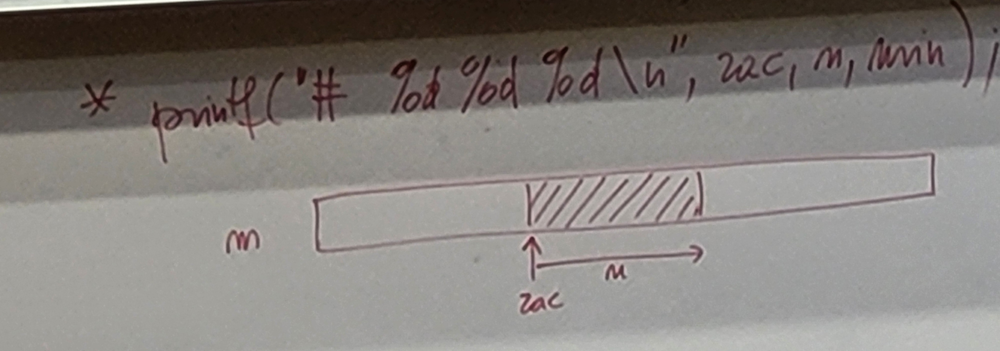

# Rekurzija 2

```c
int f(int *p[10]) {...}
int main(int argx, char *args[]) {...}

int p;  // spremenljivka tipa int
int p[10];  // p je tabela 10 intov
int *p[10]; /* je isto kot */ int *(p[10]); // p je tabela 10 kazalcev na int
int (*p)[10];   // p je pointer na tabelo 10 intov
```

## Towers of Hanoi (Hanojski stolpi)

- odmikamo na sredino (n-1 obročev)
- če jih odmikamo sodo (**n-1 je sodo**), gre prvi na C
- če jih odmikamo liho (**n-1 je liho**), gre prvi na B
- število potez je 2<sup>n</sup>-1
- osnovno nalogo razgradimo na dele za rekurzijo


### 5 obročev: A -> C preko B
- 4 obroče A -> B preko C  (obroč 1 gre na C)
- 1 obroč A -> C
- 4 obroče B -> C (obroč 1 gre na A)

```c
#include <stdio.h>

int steviloDiskov;

void hanoi(int n, char zaceten, char pomozen, char koncen){
    printf("zac: %c, pom: %c, konc: %c\n", zaceten, pomozen, koncen);
    if(n == 1){
        printf("\tPREMIK: %c -> %c\n", zaceten, koncen);
        return;
    }
    printf("v odmikanje diska %d: ", n-1);
    hanoi(n-1, zaceten, koncen, pomozen);   // odmikanje diskov (od spodaj navzgor gremo, izvaja se od zgoraj navzdol - DELOVANJE PODOBNO SKLADU, SAJ SO FUNKCIJE NA SKLADU)

    hanoi(1, zaceten, pomozen, koncen);     // premik na ciljno pozicijo

    printf("PREMIK NAZAJ\n");
    hanoi(n-1, pomozen, zaceten, koncen);   // premik odmaknjenih diskov na že odmaknjene večje
}

int main()
{
    int n;
    printf("Enter the number of disks: ");
    scanf("%d", &n);
    steviloDiskov = n;
    hanoi(n, 'A', 'B', 'C');
    return 0;
}
```


### Razlaga delovanja (po izpisih):
```js
zac: A, pom: B, konc: C     // PRVOTNI KLIC
v odmikanje diska 4: zac: A, pom: C, konc: B    // NA SKLAD DAMO FUNKCIJE ZA ODMIK n-1 DISKOV
v odmikanje diska 3: zac: A, pom: B, konc: C
v odmikanje diska 2: zac: A, pom: C, konc: B
v odmikanje diska 1: zac: A, pom: B, konc: C    // VSE NALOŽENE NA SKLAD
        PREMIK: A -> C      // IZVAJAMO IZ SKLADA (odmik diska 1)
zac: A, pom: C, konc: B
        PREMIK: A -> B      // IZVAJAMO IZ SKLADA (odmik diska 2)
PREMIK NAZAJ    // PREMIK MANJŠIH NAZAJ NA VEČJE, SAJ SMO TE ŽE UMAKNILI NA POMOŽEN POLOŽAJ
zac: C, pom: A, konc: B
        PREMIK: C -> B
zac: A, pom: B, konc: C     // IZVAJAMO IZ SKLADA (odmik diska 3)
        PREMIK: A -> C
PREMIK NAZAJ
zac: B, pom: A, konc: C
v odmikanje diska 1: zac: B, pom: C, konc: A
        PREMIK: B -> A
zac: B, pom: A, konc: C
        PREMIK: B -> C
PREMIK NAZAJ
zac: A, pom: B, konc: C
        PREMIK: A -> C
zac: A, pom: C, konc: B     // IZVAJAMO IZ SKLADA (odmik diska 4)
        PREMIK: A -> B
PREMIK NAZAJ
zac: C, pom: A, konc: B
v odmikanje diska 2: zac: C, pom: B, konc: A
v odmikanje diska 1: zac: C, pom: A, konc: B
        PREMIK: C -> B
zac: C, pom: B, konc: A
        PREMIK: C -> A
PREMIK NAZAJ
zac: B, pom: C, konc: A
        PREMIK: B -> A
zac: C, pom: A, konc: B
        PREMIK: C -> B
PREMIK NAZAJ
zac: A, pom: C, konc: B
v odmikanje diska 1: zac: A, pom: B, konc: C
        PREMIK: A -> C      
zac: A, pom: C, konc: B
        PREMIK: A -> B
PREMIK NAZAJ
zac: C, pom: A, konc: B
        PREMIK: C -> B
zac: A, pom: B, konc: C     // PREMIK SPODNJEGA (5) NA KONČNI CILJ
        PREMIK: A -> C
PREMIK NAZAJ
zac: B, pom: A, konc: C
v odmikanje diska 3: zac: B, pom: C, konc: A
v odmikanje diska 2: zac: B, pom: A, konc: C
v odmikanje diska 1: zac: B, pom: C, konc: A
        PREMIK: B -> A
zac: B, pom: A, konc: C
        PREMIK: B -> C
PREMIK NAZAJ
zac: A, pom: B, konc: C
        PREMIK: A -> C
zac: B, pom: C, konc: A
        PREMIK: B -> A
PREMIK NAZAJ
zac: C, pom: B, konc: A
v odmikanje diska 1: zac: C, pom: A, konc: B
        PREMIK: C -> B
zac: C, pom: B, konc: A
        PREMIK: C -> A
PREMIK NAZAJ
zac: B, pom: C, konc: A
        PREMIK: B -> A
zac: B, pom: A, konc: C
        PREMIK: B -> C
PREMIK NAZAJ
zac: A, pom: B, konc: C
v odmikanje diska 2: zac: A, pom: C, konc: B
v odmikanje diska 1: zac: A, pom: B, konc: C
        PREMIK: A -> C
zac: A, pom: C, konc: B
        PREMIK: A -> B
PREMIK NAZAJ
zac: C, pom: A, konc: B
        PREMIK: C -> B
zac: A, pom: B, konc: C
        PREMIK: A -> C
PREMIK NAZAJ
zac: B, pom: A, konc: C
v odmikanje diska 1: zac: B, pom: C, konc: A
        PREMIK: B -> A
zac: B, pom: A, konc: C
        PREMIK: B -> C
PREMIK NAZAJ
zac: A, pom: B, konc: C
        PREMIK: A -> C
```

### Kot lahko opazimo, je rekurzija razbitje problema na podprobleme in nato reševanje le teh tako, da postavimo funkcije na sklad v napačnem vrstnem redu in ko se sproži usatavitveni pogoj se te funkcije iz sklada izvedejo v pravem vrstnem redu

...naredi da funkcija vrne število potez

...naredi da vrne kateri obroč premaknemo kam

...naredi da izpiše:

5 4</br>
3</br>
2 1</br>

## Množenje matrik

n matrik: m<sub>1</sub> x m<sub>2</sub>, m<sub>2</sub> x m<sub>3</sub>, m<sub>3</sub> x m<sub>4</sub>, ... , m<sub>n</sub> x m<sub>n+1</sub>&nbsp;&nbsp;&nbsp;&nbsp;&nbsp;(mali m-ji so dimenzije matrik)</br>
&nbsp;&nbsp;&nbsp;&nbsp;&nbsp;&nbsp;&nbsp;&nbsp;&nbsp;&nbsp;&nbsp;&nbsp;&nbsp;&nbsp;&nbsp;&nbsp;&nbsp;&nbsp;M<sub>1</sub>&nbsp;&nbsp;&nbsp;&nbsp;&nbsp;&nbsp;&nbsp;&nbsp;&nbsp;&nbsp;&nbsp;&nbsp;M<sub>2</sub>&nbsp;&nbsp;&nbsp;&nbsp;&nbsp;&nbsp;&nbsp;&nbsp;&nbsp;&nbsp;&nbsp;&nbsp;M<sub>3</sub>&nbsp;&nbsp;&nbsp;&nbsp; ... &nbsp;&nbsp;&nbsp;&nbsp;M<sub>n</sub>

```m x m, m x m --> m x m``` ...skupaj... **m<sup>3</sup> množenj**

m<sub>1</sub> x m<sub>2</sub>, m<sub>2</sub> x m<sub>3</sub> --> m<sub>1</sub> x m<sub>3</sub> ...skupaj... **m<sub>1</sub>m<sub>2</sub>m<sub>3</sub> množenj** (vrstice x stolpci x stolpciVDrugi)

(AB)C = A(BC)

((M<sub>1</sub> M<sub>2</sub>) M<sub>3</sub>) M<sub>4</sub></br>
(M<sub>1</sub> M<sub>2</sub>) (M<sub>3</sub> M<sub>4</sub>)</br>
(M<sub>1</sub> (M<sub>2</sub> M<sub>3</sub>)) M<sub>4</sub></br>
...</br>


```c
#include <limits.h>

int st_mnozenj(int m[], int n){
    if(n == 1)
        return 0;

    int min = INT_MAX;
    for(int i = 1; i <= n-1; i++){  // i je število matrik na levi strani
        int l = st_mnozenj(&(m[0]), i); // &(m[0]) je isto kot m
        int d = st_mnozenj(&(m[i]), n-i);
        int vsehPriI = m[0] * m[i] * m[n] + l + d;
        if(vsehPriI < min){
            min = vsehPriI;
        }
    }
    return min;
}
```


```c
int m[] = {...};
int n;
int memo[1000][1000];

int st_mnozenj(int zac, int n){
    if(n == 1)
        return 0;
    if(memo[zac][n] != 0){
        return memo[zac][n];
    }
    int min = INT_MAX;
    for(int i = 1; i <= n-1; i++){
        int l = st_mnozenj(zac, i);
        int d = st_mnozenj(zac+i, n-i);
        int vsehPriI = m[zac] * m[zac+i] * m[zac+n] + l + d;
        if(vsehPriI < min){
            min = vsehPriI;
        }
    }
    printf("# %d %d %d\n", zac, n, min);
    memo[zac][n] = min;
    return min;
}
```



```
$ ./matrike | grep '#' | sort | wc
$ ./matrike | grep '#' | sort -u | wc
// z memoizacijo lahko prihranimo toliko časa
$ time ./matrike
```

- s permutacijami:


