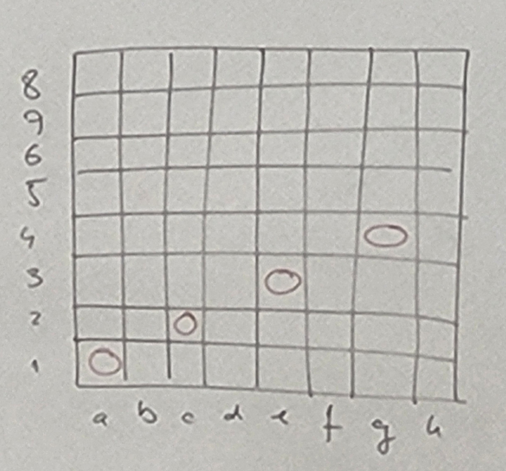

# Rekurzija 3 in strukture

## Rekurzija 3

Postavljanje 8 kraljic na šahovsko polje tako, da se ne napadajo

```
1. bool board[8][8];   // true - kraljica
2. int board[8];    // indeks stolpec, vsebina vrstica; prazen stolpec: vsebina -1 
```




```c
bool queens(int board[], int n, int q){     // q - številka kraljice oziroma vrstice
    if(q == n){     // ce smo ze postavili 8 kraljic
        // izpiši
        return true;
    }

    for(int i = 0; i < n; i++){ // preverimo vse možnosti kraljic v naslednjem stolpcu (i gre po vrsticah)
        bool valid = true;

        // preverimo vrstice
        // preverimo diagonale /
        // preverimo diagonale '\'

        if(valid){
            board[q] = i;   // q je stolpec, i je vrstica
            bool success = queens(board, n, q+1);
            if(success)
                return true;
        }
    }
    return false;   // ni rešitve za to kombinacijo (vsak stolpec mora biti zapolnjen za 8 kraljic)
}
// izpis vseh rešitev...
// izpis enoličnih rešitev (brez rotacij, inverznih postavitev)

// kakršnakoli rešitev problema 8 kraljic predstavljena v načinu 8 intov bo permutacija (če ni, kombinacija ni veljavna), ni pa vsaka permutacija rešitev:
// -> lahko iščemo vse permuatcije in potem za vsako preverimo pogoje in če drži je to veljavna kombinacija (prevedba na problem permutacij):
//      vzamemo funkcijo za izpis permutacij
//      jo dopolnim s testi napadanja
//      spremenim/dopolnim izpis
// prva možnost dela hitreje kot permutacije, ker pri prvem primeru ne gremo čez vrstico v kateri smo že (porežemo velik del drevesa že med izvajanjem), permutacije pa gre čez vse (polno drevo)
```

## Strukture

- ko želimo več različnih vrst/tipov podatkov skupaj

```c
struct complex_c{
    double x;
    double y;
};

int main(){
    
    struct complex_c c1, c2, c3;    // spremenljivke so tipa struct complex_c
    struct complex_c* c4;

    c1.x = 1.2;
    c4->x = -3.5;

    return 0;
}
```

- poimenovanje tipa:
```c
typedef int integer;    // definicija tipa - namesto int lahko pišemo integer
typedef int* pint;  // pint je ime tipa int*
typedef long long int llint;
typedef struct complex_c {double x; double y;} c_complex;   // namesto da pišemo cel tip: struct complex_c, pišemo samo c_complex:

double f(struct complex_c c){
    c.x = 2 * c.x;
    c.y = 2 * c.y;
    return abs_c(c);
}

double abs_c(c_complex stevilo){
    return sqrt(sqr(stevilo.x) + sqr(stevilo.y));
}

int main(){

    c_complex c1, c2, c3;
    c1.x = 1.2;
    c1.y = -3.5;
    printf("%lf\n", f(c1)); // neko število
    printf("%lf %lf\n", c1.x, x2.y);    // 1.2 -3.5

    printf("%d\n", sizeof(struct complex_c));   // za 2 double tipa: 16 B
    // struct pošljemo isto kot primitivne tipe (npr. int, ne pointer)

    return 0;
}
```

```c
int b[100];    // same ničle
struct intarr{
    int a[100];
};  // zasede 400 B
struct intarr b;    // same ničle

void incarr(int a[100]){    // sprejmemo naslov
    for(int i = 0; i < 100; i++){
        a[i] = a[i] + 1;
    }
}

void incstr(struct intarr arr){     // sprejmemo vrednost
    for(int i = 0; i < 100; i++){
        arr.a[i] = arr.a[i] + 1;
    }
}

void incstrp(struct intarr* arr){   // sprejmemo naslov
    for(int i = 0; i < 100; i++){
        (*arr).a[i] = (*arr).a[i] + 1;  // struktura se nanaša na vrednost na prvem naslovu, kjer je struktura alocirana
    }
}

int main(){

    incarr(b);  // pošljemo naslov b-ja; incarr spreminja b
    printf("%d\n", b[0]);   // izpiše 1

    incstr(b);  // pošljemo vrednost b-ja (400 B prenesemo v funkcijo), incstr ne spreminja b-ja
    printf("%d\n", b.a[0]);   // izpiše 0

    // strukture pošiljamo po vrednosti

    incstrp(&b);    // pošiljamo 8 B
    printf("%d\n", b.a[0]);   // izpiše 1

    return 0;
}
```

```c
struct complex_c{
    double x;
    double y;
};

int main(){
    struct complex_c c1, c2, c3;
    c1.x = 1.2;
    c1.y = -3.5;

    struct complex_c *pc1, *pc2, *pc3;
    pc1 = 1.2;  // NAROBE, ker je pc1 kazalec
    pc1.x = 1.2;  // NAROBE, ker je pc1 kazalec

    (*pc1).x = 1.2; // PRAVILNO (pc1 je kazalec/naslov, *pc1 je struktura)
    pc1->x = 1.2;   // enakovredno zgornji vrstici

    return 0;
}
```

```c
struct s {
    int i;      // 4 B
    char c;     // 1 B
    double d;   // 8 B
};  // rabimo 13 B, je pa lahko velikost strukture večja (ohranja pomnilniško poravnanost (npr. na 4 B ... poravnani podatki da so na naslovih deljivih z 4), odvisno od procesorja/prevajalnika)
// s bo poravnan na 8
// i bo poravnan na 4
// c bo poravnan na 1
// d bo poravnan na 8
```


torej uporabljamo ```sizeof(struct s)``` in ne ```sizeof(int) + sizeof(char) + sizeof(double)``` ker to dvoje ni vedno enako


```c
int l[5];   // predstavimo s tabelo
int* ll;    // predstavimo z dinamično tabelo

typedef struct node {
    int i;
    struct node *next;
} node, *list;  // novo ime strukture je node; novo ime kazalca na strukturo je list

/*
enakovredno:
list l;     // pointer na seznam l struktur node
node *l;    // pointer na prvo strukturo node l
*/
```


