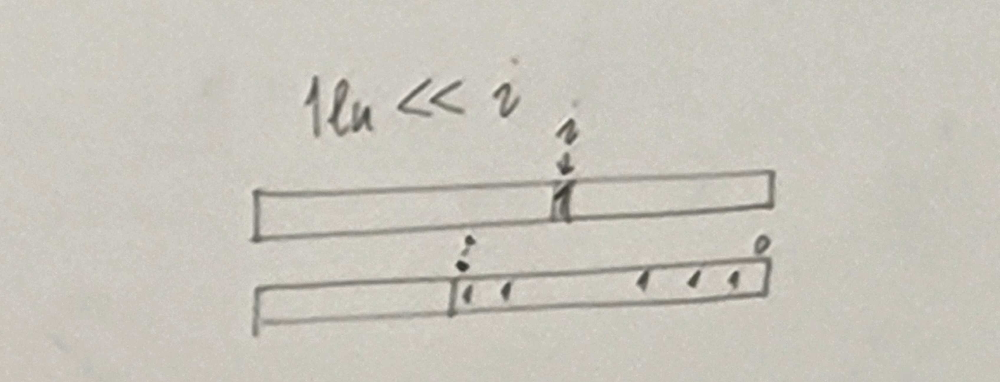
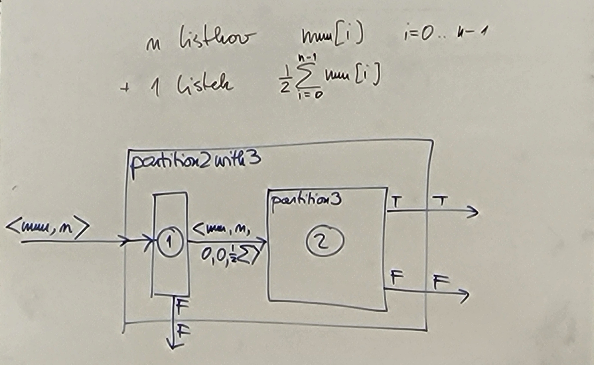
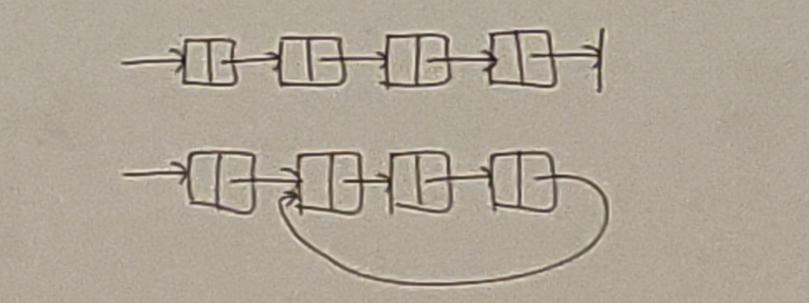
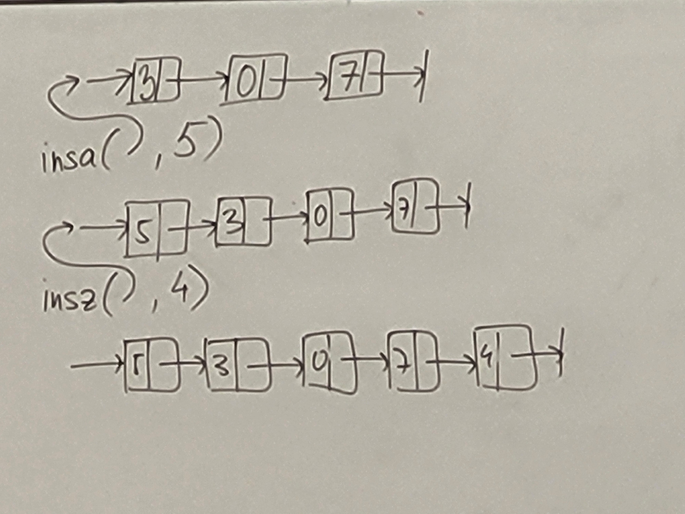
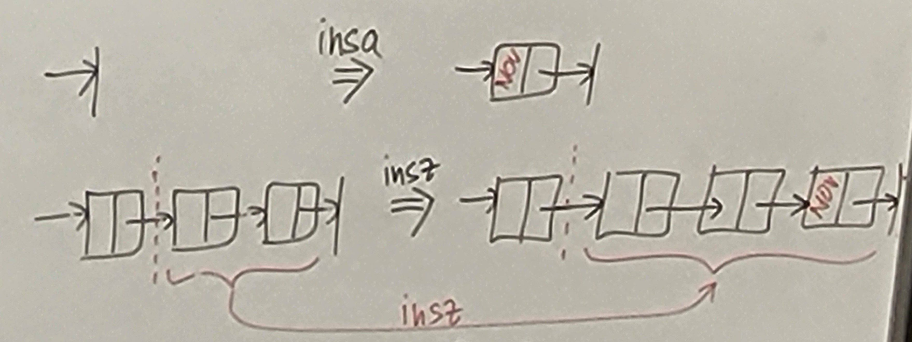
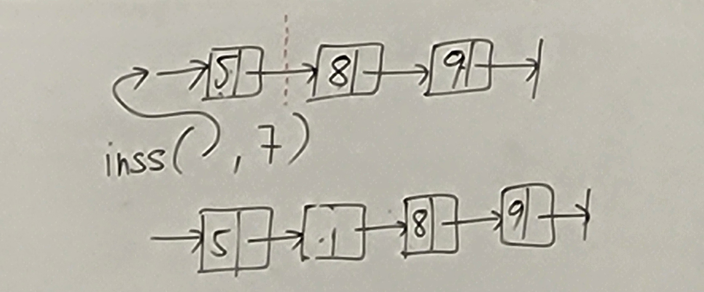
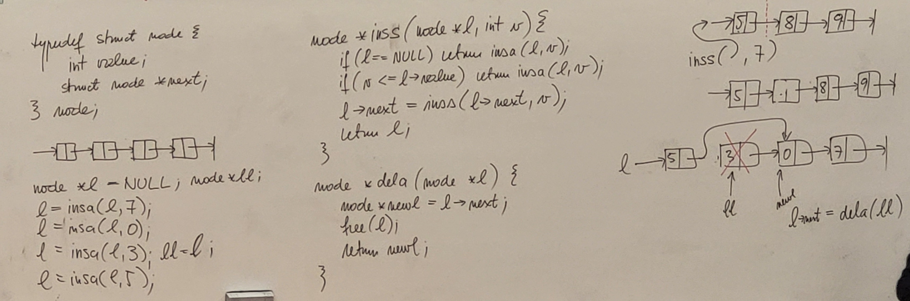

# Rekurzija 4 in strukture 2

## Rekurzija 4

- n listkov, vsak ima na sebi vrednost v, ki je element naravnih števil
- želimo da je na 2 kupih enaka vsota, če je to mogoče
- z rekurzijo **pregledamo vse kombinacije**
- naredimo vektor dolžine n
- vzamemo število *unsigned long int*:
    - nums[] ... vrednosti na listkih
    - partition ... bitni vektor delitve

```c
// iterativno:
bool partition(int* nums, int n){
    // 0 na enem kupu, 1 na drugem
    for(unsigned long int p = 0lu; p < (1lu << n); p++){   // 2^n kombinacij
        int sum0 = 0;   // koliko je na levem kupu
        for(int i = 0; i < n; i++){
            if((p & (1lu << i)) == 0){
                sum0 += nums[i];
            }
        }
        int sum1 = 0;   // koliko je na desnem kupu
        for(int i = 0; i < n; i++){
            if((p & (1lu << i)) != 0){
                sum1 += nums[i];
            }
        }

        if(sum0 == sum1)
            return true;
    }
    return false;
}

// rekurzivno:
bool partition2(int* nums, int n, int sum0, int sum1){     // 2^n
    if(n == 0){ // nimamo več listkov
        return sum0 == sum1;
    }

    if(partition2(&num[1], n-1, sum0 + num[0], sum1)){    // pošljemo samo preostanek tabele
        return true;
    }
    if(partition2(&num[1], n-1, sum0, sum1 + num[0])){
        return true;
    }
    return false;
}

// na 3 kupe:
bool partition3(int* num, int n, int sum0, int sum1, int sum2){     // 3^n
    if(n == 0){
        return sum0 == sum1 && sum1 == sum2;
    }
    
    if(partition3(&num[1], n-1, sum0 + num[0], sum1, sum2)){
        return true;
    }
    if(partition3(&num[1], n-1, sum0, sum1 + num[0], sum2)){
        return true;
    }
    if(partition3(&num[1], n-1, sum0, sum1, sum2 + num[0])){
        return true;
    }
    return false;
}
```



Imamo partition3, iščemo partition2:
- lahko vzamemo m listkov in dodamo še enega s polovico vsote iz teh m listkov
- tako bo tretji kup imel enako vsoto in v bistvu iščemo partition2
- če je vsota liha, ni rešitve na 2 kupa
```c
bool partition2with3(int* num, int n){
    // [1.] predprocesiranje:
    int sum = 0;
    for(int i = 0; i < n; i++){
        sum += num[i];
    }
    if(sum % 2 != 0){
        return false;
    }

    // [2.] klic funkcije partition3:
    return partition3(num, n, 0lu, 0lu, sum / 2);
}
```



- [2.] porabi čas ```3^n```, [1.] pa ```n```
- zato namesto z ```2^n``` rešujemo z ```n + 3^n``` (ni smiselno)
- prevedba - reševanje enega problema z drugim
- vidimo, da če se partition2 ne da narediti hitreje kot 2^n, se tudi partition3 ne da

partition m (na m kupov)...


## Strukture 2

```c
typedef struct node {
    int value;
    struct node* next;
} node; // ime tipa (typedef)
```
- povezan seznam:



- radi bi naredili osnoven nabor funkcij, da jih lahko uporabimo na seznamu

```c
node* l = NULL;

node* insa(node* list, int value){   // insert at the beginning
    node* newl = (node*) malloc(sizeof(node));
    (*newl).value = v;  //newl -> value = v
    (*newl).next = l;//newl -> next = l
    return newl;
}

l = insa(l, 7);
l = insa(l, 0);
l = insa(l, 3);
l = insa(l, 5);

node* insz(node* l, int v){   // insert at the end
    if(l == NULL){
        return insa(l, v);
    }
    node* ll = l;
    while((*ll).next != NULL){
        ll = (*ll).next;
    }
    (*ll).next = insa((*ll).next, v);
    return l;
}
// rekurzivno:
node* inszRekurzivno(node* l, int v){
    if(l == NULL){
        return insa(l, v);
    }
    (*l).next = inszRekurzivno((*l).next, v);
    return l;
}

node* inss(node* l, int v){   // vstavi v sortiran seznam
    if(l == NULL){
        return insa(l, v);
    }
    if(v <= (*l).value){
        return insa(l, v);
    }
    (*l).next = inss((*l).next, v);
    return l;
}

node* dela(node* l){    // izbriši prvo škatlo
    node* newl = (*l).next;
    free(l);
    return newl;
}
```







- Nevarno:


