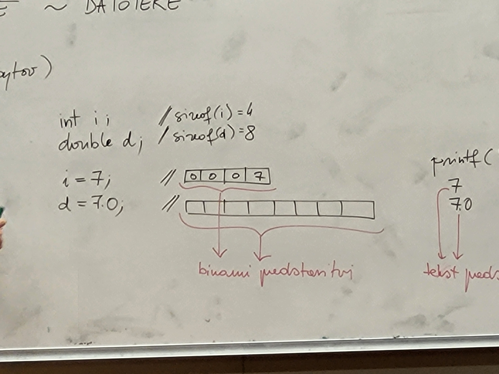

# Vhodno izhodne operacije - datoteke

datoteka: zaporedje podatkov (na disku zaporedje bajtov)

vrste:
- tekstovne datoteke (lep izpis z npr. more)
- binarne datoteke (nerazumljiv izpis)





(določiti je treba tip datoteke (tekst ali ne), endian - da bo ista predstavitev na drugih procesorjih - težave pri binarnih datotekah)
težave pri tekstovnih datotekah: če imamo znake različne dolžine, int lahko zapišemo z različno znaki, pri double/float izpisujemo približke in ne točne vrednosti (kodiranje je večinoma dobro prenosljivo)

```c
#include <stdio.h>

int main(){
    int i = 7;
    double d = 7.0;

    // spremenljivka na vsebuje vsebine datoteke, ampak kazalec nanjo
    FILE* f;
    f = fopen("podatki.txt", "w");  // sproži ustvarjanje te datoteke v trenuntnem direktoriju in odpiranje, se jo pripravi za pisanje, v f se shrani kazalec na nekaj, kar je v pomnilniku (kateri disk, kateri del diska, ali je dovoljeno pisati ...), f je povezava do fizične datoteke na disku

    fprintf(f, "%1d\n%3.1lf\n", i, d);  // zapisemo v datoteko, (man fprintf)
    fclose(f);  // zapiranje datoteke
    return 0;
}
```

```c
FILE* fopen(char* name, char* mode);    // mode: "r", "w", "a", ... (man fopen)

int fclose(FILE* f);    // man fclose
```

- načini dela z datoteko:
  - ```r``` -> read
  - ```w``` -> write
  - ```a``` -> append
  - ```r+``` -> read/write
  - ```w+``` -> write/read
  - ```a+``` -> append/read

- če je f NULL, ni uspelo odpiranje datoteke

```c
...
FILE* f;
f = fopen("podatki.txt", "w");
if(f == NULL) {
    printf("Datoteke ne morem odpreti.\n");
    exit(1);
}
...
int is_ok = fclose(f);
if(is_ok != 0){
    printf("Datoteke ne morem zapreti.\n");
    exit(1);
}
```
```c
// že odprte datoteke (zato lahko uporabljamo skrajšane oblike funkcij):
FILE* stdin, stdout, stderr // prva na tipkovnico, ostali na zaslon

fprintf(stdout, "formatniNiz", _, _, ..., _);
printf("formatniNiz", _, _, ..., _);    // okrajšava zgornje vrstice

fscanf(stdin, "formatniNiz", _, _, ..., _);
scanf("formatniNiz", _, _, ..., _);    // okrajšava zgornje vrstice
```

```shell
$ ./prg 2 > napake.txt
```
- 2 je stderr

```c
// zapisovanje na binarno datoteko:
fwrite(&i, sizeof(int), 1, f);
fwrite(&d, sizeof(double), 1, f)
// man fwrite, man fread - branje iz binarne datoteke
```

```c
char board[8][8];
int n_queens;

// izpis:
fwrite(board, sizeof(board), 1, f);
fwrite(&n_queens, sizeof(n_queens), 1, f);

// branje:
fread(board, sizeof(board), 1, f);
fread(&n_queens, sizeof(n_queens), 1, f);
```

- če želimo izpisati števila 7, 135, 22 (kot int):</br>
**bin**: 0 0 0 7 0 0 0 135 0 0 0 22</br>
**txt**: 55 \n 49 51 53 \n 50 50 \n (ASCII)</br>
- kako bi izpisali 3. število?</br>
**bin**: izračunamo (3-1)*sizeof(int)</br>
**txt**: gremo čez vse prejšnje</br>

```c
typedef struct node {
    int value;
    struct node* next;
} node;

node* l;    // l -> 5 -> 7 -> 3 -> 4 -> |

fwrite(&l, sizeof(l), 1, f);    // shrani naslov l-ja, kar nima smisla

node* tmp = l;
while(tmp != NULL){
    //fwrite(tmp, sizeof(node), 1, f);    // shranjujemo value in next - nima smisla
    fwrite(&(tmp->value), sizeof(int), 1, f);
    tmp = tmp->next;
}
```