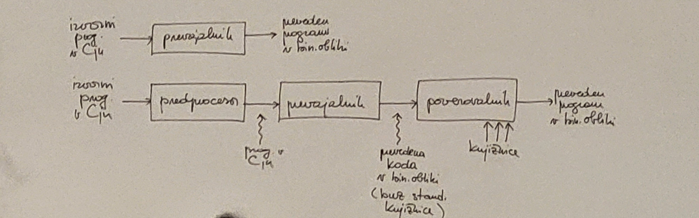
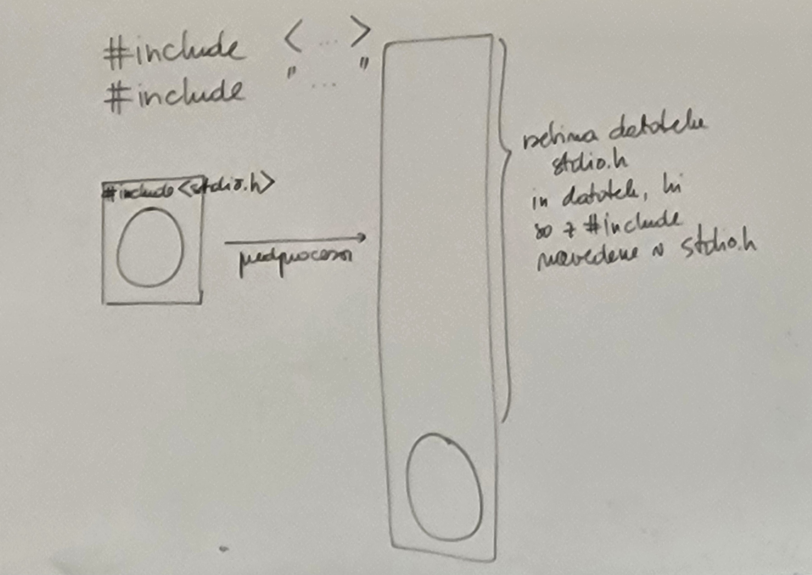
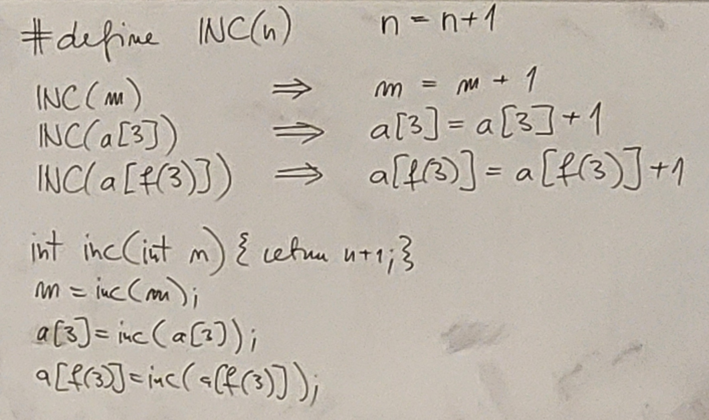
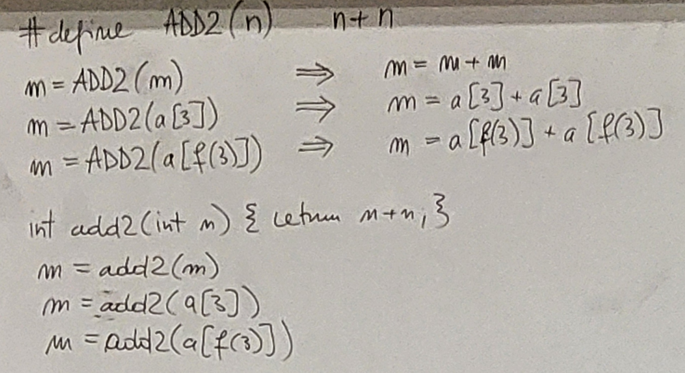
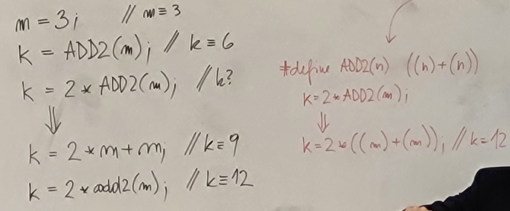
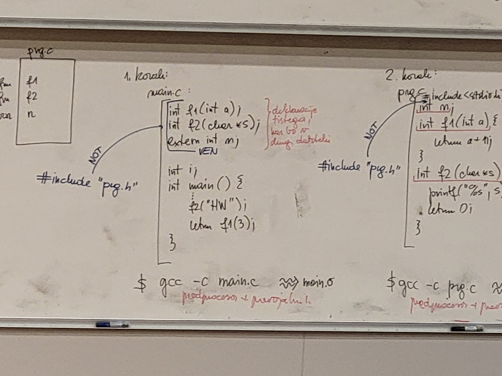
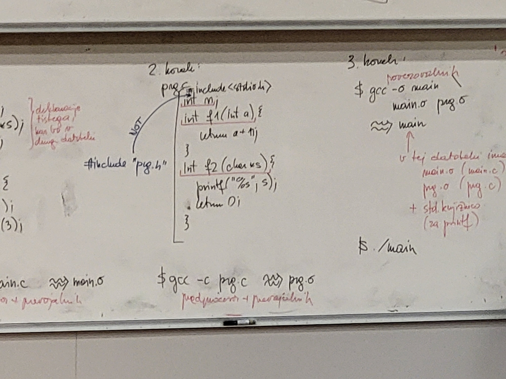
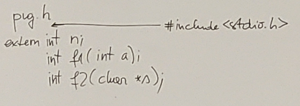
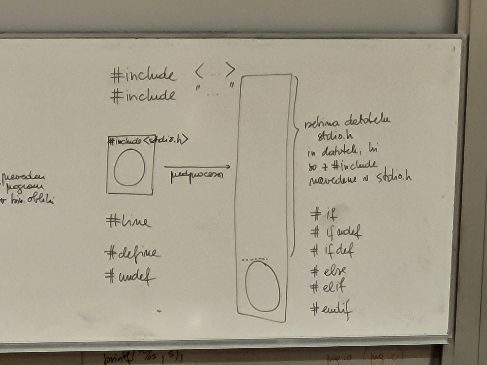

# Predprocesor

izvorni program v C --> prevajalnik --> preveden program v binarni obliki

izvorni program v C --> predprocesor --> (program v C) --> prevajalnik --> (prevedena koda v binarni obliki brez standardne knjiznice) --> povezovalnik (doda knjižnice) --> preveden program v binarni obliki 



- npr. ukaz #include (prevajalnik tega ukaza nikoli ne vidi):
```c
#include <...>  // navedeno datoteko poišči na disku na sistemskem delu (kjer je prevajalnik) .. ve kje so
#include "..."  // išči datoteko na tem direktoriju .. mi določimo kje
```
- kopira kodo iz datoteke in jo vstavi



```c
# line 1000 // izpiše vrstico morebitne napake glede na podano

#define N 10
int n = N;
// ko gredo zgornji vrstici skozi predprocesor, N zamenja z 10 povsod v programu
int _N = N; // OK, saj ne zamenja _N z 10
int N = N;  // napaka

int always_ten = 10;
int n = always_ten;
int N = always_ten;
int _N = always_ten;
```

```c
# define PP ++
int n = 10;
...
n PP;   // n ++; (n se inkrementira za 1)
```

```c
# define MAIN main
(int argc, char* argv[])
int MAIN {...}  // int main (int argx, char* argv[]) {...}
```

- Lahko definiramo tudi makroje:



- Makroji so veliko hitrejši od funkcij, ker delajo na drugem nivoju kot funkcije - najprej razvijejo kodo in šele potem izračunajo, funkcije pa gredo takoj računati:



- Paziti moramo na oklepaje:



```c
#define ne_ok_SQR(n) n*n
#define SQR(n) ((n)*(n))
#define ne_ok_MAX(a, b) a < b ? b:a
#define MAX(a, b) ((a) < (b) * (b):(a))

int main(){

    int m = ne_ok_SQR(m+1);   // => m = m + 1 * m + 1
    int n = SQR(n+1);   // => n = (n+1)*(n+1)

    int i = ne_ok_MAX(5, 10) + 1;   // => 5 < 10 ? 10:5+1 = 10
    int j = ne_ok_MAX(10, 5) + 1;   // => 10 < 5 ? 5:10+1 = 11

    return 0;
}

#undef ne_ok_SQR // undefine macro - SAMO IME! - pod to vrstico ni več dostopen
```

- Delo z več datotekami - kako narediti čim bolj čitljiv in strukturiran program:

```c
//main.c
int f1(int n);
int f2(char* s);
extern int m;

int main() {
    f2("HW");
    return f1(3);
}
```




- header file je datoteka, ki vsebuje deklaracije funkcij, makrov itd. za uporabo v več datotekah (organizacija, berljivost, zaščita pred dvakratnim vključevanjem - glej pogojno definiranje), in se jo vključi z #include "prg.h"





- Pogojno definiranje (makroja) (če še ni definiran):

```c
#ifndef __STDIO_H__
#define __STDIO_H__
...
#endif
```

```c
// prg.h header file
#ifndef __PRG_H__
#define __PRG_H__
extern int n;
int f1(int a);
int f2(char* s);
#endif
```


